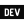

# Template &middot;  

Template you can use to start our "Open Source" repositories.

## Starting a new repository

### Create a new repository from template

Go to https://github.com/JStrategia/Template and click on the "Use this template" action button. Then you can create your new repository as usual. You will have all the folders and files from the template in the new repo.

### Change the markdown files

Update the [Code of conduct](CODE_OF_CONDUCT.md), [Contributing](CONTRIBUTING.md), and [Issue Template](ISSUE_TEMPLATE.md). Search for `<-- TODO -->` in those files.

### Remove this first section of the readme

Delete everything before that smiling smiley 🙂

<!-- TODO -->
# Name of your repository

> Tagline / quick description

## Section #1

## Section #2

## Core Team

<table>
  <tr>
    <td align="center">
      <a href="https://github.com/Thibautj88">
        
         
        
          <b>TEMPLATE USER</b>
        
      </a>
      <!-- Uncomment if you need to add links 👇 -->
       
      
      
      
       
      
      
      
    </td>
    <!-- Add other core team members -->
    <td align="center">
      <a href="https://github.com/Thibautj88">
        
         
        
          <b>Thibaut Dupont</b>
        
      </a>
      <!-- Uncomment if you need to add links 👇 -->
       
      
      
    </td>
    <td align="center">
      <a href="https://github.com/g-morin">
        
         
        
          <b>Guillaume Morin</b>
        
      </a>
      <!-- Uncomment if you need to add links 👇 -->
       
      
      
    </td>
    <td align="center">
      <a href="https://github.com/royerpa">
        
         
        
          <b>Pierre-Alexandre Royer</b>
        
      </a>
      <!-- Uncomment if you need to add links 👇 -->
       
      
    </td>
    <td align="center">
      <a href="https://github.com/yanb1">
        
         
        
          <b>Yan Boivin</b>
        
      </a>
      <!-- Uncomment if you need to add links 👇 -->
       
      
    </td>
  </tr>
</table>

## Contributors

<table>
  <tr>
    <td align="center">
      <a href="https://github.com/Thibautj88">
        
         
        
          <b>TEMPLATE USER</b>
        
      </a>
      <!-- Uncomment if you need to add links 👇 -->
       
      
      
      
       
      
      
      
    </td>
    <!-- Add other core team members -->
    <!--
    <td align="center">
    </td>
    -->
  </tr>
</table>

<!-- END TODO -->
